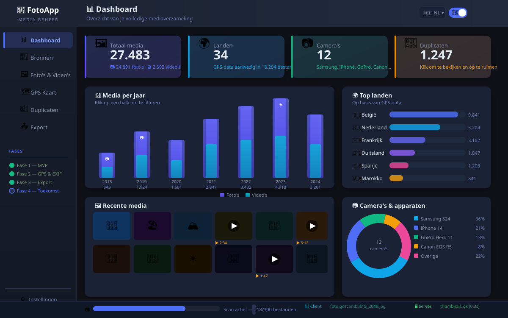

<div align="center">



# 📸 FotoApp

**Gratis · Lokaal · Privé · Open Source · Foto's én Video's**

[](https://github.com/boulbaal/fotoApp/releases/latest)
[](https://github.com/boulbaal/fotoApp/actions)
[](https://github.com/boulbaal/fotoApp/stargazers)
[](LICENSE)

**[⬇️ Download voor Windows](https://github.com/boulbaal/fotoApp/releases/latest/download/FotoApp-Setup-1.0.0.exe)** · **[🌐 Website](https://boulbaal.github.io/fotoApp/)** · **[🐛 Bug melden](https://github.com/boulbaal/fotoApp/issues/new?template=bug_report.md)** · **[💡 Idee delen](https://github.com/boulbaal/fotoApp/issues/new?template=feature_request.md)**

---

🇳🇱 [Nederlands](#-nederlands) · 🇬🇧 [English](#-english) · 🇫🇷 [Français](#-français) · 🇩🇪 [Deutsch](#-deutsch) · 🇪🇸 [Español](#-español) · 🇸🇦 [العربية](#-عربي)

</div>

---

## 🇳🇱 Nederlands

### Wat is FotoApp?

FotoApp is een **gratis, open-source desktopapplicatie** voor het organiseren van duizenden foto's en video's — op jouw eigen machine, zonder cloud, zonder abonnement, zonder dat iemand jouw privéfoto's te zien krijgt.

Gebouwd voor mensen zoals Ali, die 27.000+ foto's hebben verspreid over meerdere schijven, USB-sticks en mappen, en gewoon wil weten: *waar staat alles, en wat heb ik dubbel?*

### ✨ Functies

| | Functie | Beschrijving |
|---|---|---|
| 🔍 | **Duplicaatdetectie** | Vindt exacte duplicaten via MD5-hash — ook als bestandsnaam verschilt |
| 🗺️ | **GPS-kaart** | Interactieve wereldkaart met al je fotolocaties (Leaflet + OpenStreetMap) |
| 📊 | **Dashboard** | Statistieken per jaar, camera en land — apart voor foto's én video's |
| 📷 | **RAW-support** | Thumbnails van Canon CR2/CR3, Nikon NEF, Sony ARW, Fuji RAF via exiftool |
| 🌍 | **Geocoding** | Automatisch stad en land ophalen uit GPS-coördinaten (Nominatim, privé) |
| 📤 | **Slimme export** | `Nederland_Amsterdam_15_06_2023.jpg` geordend per jaar/maand |
| 🎬 | **Video-support** | MP4, MOV, AVI met aparte statistieken en grafieken |
| 🇬 | **Google Takeout** | JSON-metadata lezen voor datum en GPS-fallback |
| 🚫 | **Negeer-cascade** | Duplicaten groepsgewijs negeren bij export |
| 🔌 | **Electron desktop** | Native Windows, Mac & Linux app |

### 📥 Installeren

**Windows (aanbevolen):**
1. Download [FotoApp-Setup-1.0.0.exe](https://github.com/boulbaal/fotoApp/releases/latest/download/FotoApp-Setup-1.0.0.exe) (~94 MB)
2. Dubbelklik → bij SmartScreen: **"Meer informatie" → "Toch uitvoeren"**
3. Open FotoApp via het startmenu

**Mac & Linux (zelf bouwen):**
```bash
git clone https://github.com/boulbaal/fotoApp.git
cd fotoApp && npm install
npm run build:mac    # → dist/FotoApp-1.0.0.dmg
npm run build:linux  # → dist/FotoApp-1.0.0.AppImage
```

### 🤝 Bijdragen

Ideeën en verbeteringen zijn welkom! Alle pull requests worden persoonlijk beoordeeld en goedgekeurd door de beheerder. Lees [CONTRIBUTING.md](CONTRIBUTING.md) voor de spelregels.

---

## 🇬🇧 English

### What is FotoApp?

FotoApp is a **free, open-source desktop application** for organizing thousands of photos and videos — on your own machine, without cloud, without subscription, without anyone seeing your private photos.

No Google Photos. No iCloud. No Amazon. **Your photos stay yours.**

### ✨ Features

| | Feature | Description |
|---|---|---|
| 🔍 | **Duplicate detection** | Finds exact duplicates via MD5 hash — even if filenames differ |
| 🗺️ | **GPS map** | Interactive world map with all your photo locations |
| 📊 | **Dashboard** | Statistics by year, camera and country — separate for photos & videos |
| 📷 | **RAW support** | Thumbnails for Canon, Nikon, Sony, Fuji RAW files via exiftool |
| 🌍 | **Geocoding** | Auto-fetch city & country from GPS coordinates (privacy-first, Nominatim) |
| 📤 | **Smart export** | `Netherlands_Amsterdam_15_06_2023.jpg` sorted by year/month |
| 🎬 | **Video support** | MP4, MOV, AVI with separate statistics and charts |
| 🇬 | **Google Takeout** | Reads JSON metadata for date and GPS fallback |
| 🔌 | **Electron desktop** | Native Windows, Mac & Linux app |

### 📥 Installation

**Windows (recommended):**
1. Download [FotoApp-Setup-1.0.0.exe](https://github.com/boulbaal/fotoApp/releases/latest/download/FotoApp-Setup-1.0.0.exe) (~94 MB)
2. Double-click → if SmartScreen warns you: **"More info" → "Run anyway"**
3. Open FotoApp from the Start Menu

**Mac & Linux (build from source):**
```bash
git clone https://github.com/boulbaal/fotoApp.git
cd fotoApp && npm install
npm run build:mac    # → dist/FotoApp-1.0.0.dmg
npm run build:linux  # → dist/FotoApp-1.0.0.AppImage
```

**Run locally (browser mode, no Electron):**
```bash
npm install
sh start.sh   # runs tests + starts server at http://localhost:3000
```

### 🔧 Optional system tools (strongly recommended)

```bash
# Windows
choco install exiftool ffmpeg

# macOS
brew install exiftool ffmpeg

# Linux
sudo apt install libimage-exiftool-perl ffmpeg
```

Without these: RAW thumbnails and video thumbnails won't be generated. Everything else still works.

### 🤝 Contributing

Contributions are welcome! All pull requests are personally reviewed and approved by the maintainer. Please read [CONTRIBUTING.md](CONTRIBUTING.md) before submitting.

### 🔒 Privacy

- Zero data sent to external servers
- GPS coordinates sent to Nominatim (OpenStreetMap) only for reverse geocoding — no photos, no tracking
- All your data stays local on your machine

### 🛠️ Tech stack

`Node.js` · `Express` · `SQLite (better-sqlite3)` · `Electron` · `sharp` · `exiftool` · `Leaflet` · `Vanilla JS`

---

## 🇫🇷 Français

### Qu'est-ce que FotoApp?

FotoApp est une **application de bureau gratuite et open-source** pour organiser vos milliers de photos et vidéos — sur votre propre machine, sans cloud, sans abonnement, sans que quiconque voit vos photos privées.

### ✨ Fonctionnalités

- 🔍 **Détection des doublons** — Trouve les fichiers identiques par hash MD5
- 🗺️ **Carte GPS** — Carte mondiale interactive avec vos emplacements photo
- 📊 **Tableau de bord** — Statistiques par année, appareil photo et pays
- 📷 **Support RAW** — Miniatures pour Canon, Nikon, Sony, Fuji via exiftool
- 🌍 **Géocodage** — Ville et pays automatiques depuis les coordonnées GPS
- 📤 **Export intelligent** — `France_Paris_15_06_2023.jpg` trié par année/mois
- 🎬 **Support vidéo** — MP4, MOV, AVI avec statistiques séparées
- 🔌 **App desktop** — Windows, Mac & Linux natif via Electron

### 📥 Téléchargement

[⬇️ Télécharger pour Windows](https://github.com/boulbaal/fotoApp/releases/latest/download/FotoApp-Setup-1.0.0.exe) (~94 MB)

Mac & Linux: compilez depuis le code source (voir section anglaise ci-dessus).

### 🤝 Contribuer

Les contributions sont les bienvenues! Toutes les pull requests sont examinées et approuvées personnellement par le mainteneur. Lisez [CONTRIBUTING.md](CONTRIBUTING.md) avant de soumettre.

---

## 🇩🇪 Deutsch

### Was ist FotoApp?

FotoApp ist eine **kostenlose, Open-Source-Desktop-Anwendung** zur Organisation tausender Fotos und Videos — auf deinem eigenen Rechner, ohne Cloud, ohne Abo, ohne dass jemand deine privaten Fotos sieht.

### ✨ Funktionen

- 🔍 **Duplikatsuche** — Findet exakte Duplikate per MD5-Hash
- 🗺️ **GPS-Karte** — Interaktive Weltkarte mit all deinen Fotostandorten
- 📊 **Dashboard** — Statistiken nach Jahr, Kamera und Land
- 📷 **RAW-Support** — Vorschaubilder für Canon, Nikon, Sony, Fuji via exiftool
- 🌍 **Geocoding** — Automatisch Stadt und Land aus GPS-Koordinaten ermitteln
- 📤 **Smarter Export** — `Deutschland_Berlin_15_06_2023.jpg` sortiert nach Jahr/Monat
- 🎬 **Video-Support** — MP4, MOV, AVI mit separaten Statistiken
- 🔌 **Desktop-App** — Natives Windows, Mac & Linux via Electron

### 📥 Download

[⬇️ Download für Windows](https://github.com/boulbaal/fotoApp/releases/latest/download/FotoApp-Setup-1.0.0.exe) (~94 MB)

Mac & Linux: Aus dem Quellcode bauen (siehe englischen Abschnitt oben).

### 🤝 Beitragen

Beiträge sind willkommen! Alle Pull Requests werden vom Maintainer persönlich geprüft und genehmigt. Bitte lies [CONTRIBUTING.md](CONTRIBUTING.md) vor dem Einreichen.

---

## 🇪🇸 Español

### ¿Qué es FotoApp?

FotoApp es una **aplicación de escritorio gratuita y de código abierto** para organizar miles de fotos y vídeos — en tu propia máquina, sin nube, sin suscripción, sin que nadie vea tus fotos privadas.

### ✨ Características

- 🔍 **Detección de duplicados** — Encuentra duplicados exactos por hash MD5
- 🗺️ **Mapa GPS** — Mapa mundial interactivo con todas tus ubicaciones de fotos
- 📊 **Panel de control** — Estadísticas por año, cámara y país
- 📷 **Soporte RAW** — Miniaturas para Canon, Nikon, Sony, Fuji via exiftool
- 🌍 **Geocodificación** — Ciudad y país automáticos desde coordenadas GPS
- 📤 **Exportación inteligente** — `España_Madrid_15_06_2023.jpg` ordenado por año/mes
- 🎬 **Soporte de vídeo** — MP4, MOV, AVI con estadísticas separadas
- 🔌 **App de escritorio** — Windows, Mac y Linux nativo via Electron

### 📥 Descarga

[⬇️ Descargar para Windows](https://github.com/boulbaal/fotoApp/releases/latest/download/FotoApp-Setup-1.0.0.exe) (~94 MB)

Mac y Linux: compila desde el código fuente (ver sección en inglés arriba).

### 🤝 Contribuir

¡Las contribuciones son bienvenidas! Todos los pull requests son revisados y aprobados personalmente por el mantenedor. Lee [CONTRIBUTING.md](CONTRIBUTING.md) antes de enviar.

---

## 🇸🇦 عربي

### ما هو FotoApp؟

FotoApp هو **تطبيق سطح مكتب مجاني ومفتوح المصدر** لتنظيم آلاف الصور ومقاطع الفيديو — على جهازك الخاص، بدون سحابة، بدون اشتراك، بدون أن يرى أحد صورك الخاصة.

### ✨ المميزات

- 🔍 **اكتشاف المكررات** — يجد الملفات المتطابقة باستخدام MD5
- 🗺️ **خريطة GPS** — خريطة عالمية تفاعلية لجميع مواقع صورك
- 📊 **لوحة الإحصاءات** — إحصائيات حسب السنة والكاميرا والدولة
- 📷 **دعم RAW** — صور مصغرة لكاميرات Canon وNikon وSony وFuji
- 🌍 **الترميز الجغرافي** — المدينة والدولة تلقائياً من إحداثيات GPS
- 📤 **تصدير ذكي** — `السعودية_الرياض_15_06_2023.jpg` مرتب حسب السنة/الشهر
- 🎬 **دعم الفيديو** — MP4 وMOV وAVI مع إحصاءات منفصلة
- 🔌 **تطبيق سطح مكتب** — Windows وMac وLinux

### 📥 التحميل

[⬇️ تحميل لـ Windows](https://github.com/boulbaal/fotoApp/releases/latest/download/FotoApp-Setup-1.0.0.exe) (~94 ميجابايت)

### 🤝 المساهمة

المساهمات مرحب بها! يتم مراجعة جميع طلبات السحب والموافقة عليها شخصياً من قبل المشرف. يرجى قراءة [CONTRIBUTING.md](CONTRIBUTING.md) قبل التقديم.

---

<div align="center">

## ⭐ إذا أعجبك المشروع، أضف نجمة! / If you like it, give it a star!

**[github.com/boulbaal/fotoApp](https://github.com/boulbaal/fotoApp)**

Made with ❤️ by [Ali](https://github.com/boulbaal)

</div>
